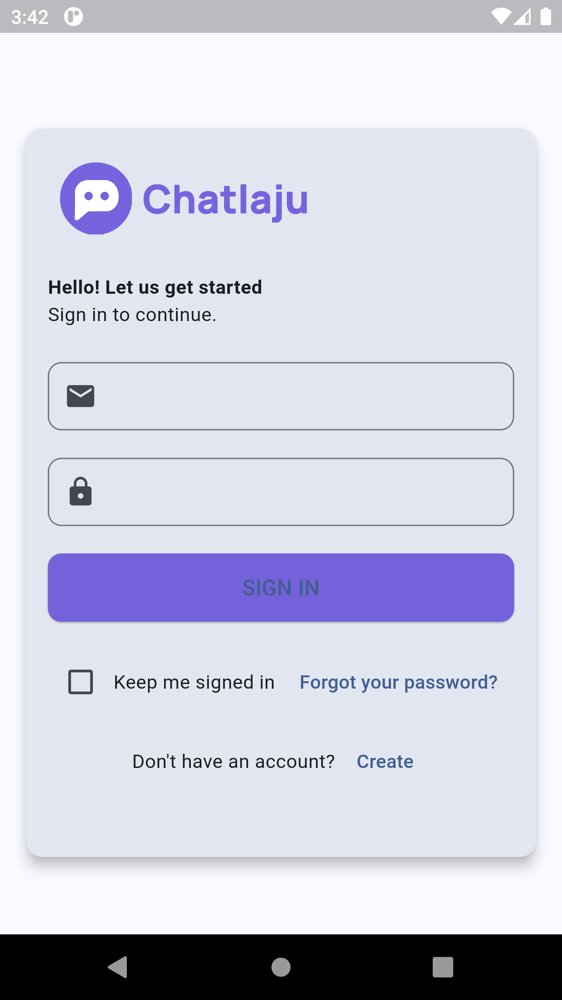

# flutter_chat_app

Chat Laju is the mobile version of https://app.chatlaju.com/login which is a platfor to accomodate all your chats from WhatsApp, Facebook, Instagram, Telegram in one single app.

## Getting Started

Make sure you visit https://app.chatlaju.com/login and email me for test credentials.

The app is also available in dark mode.

## Screenshots

    
    
    

    
    
    

    
    

